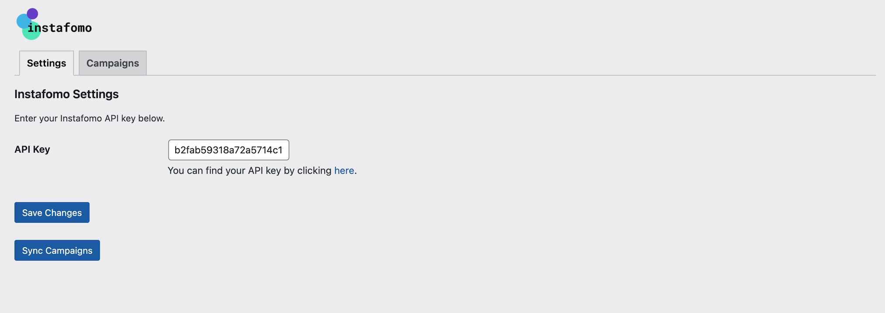
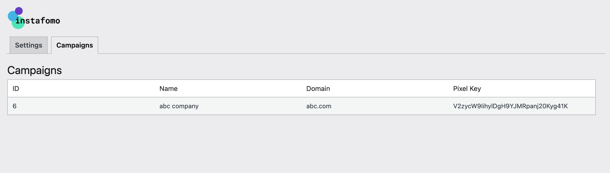

# Instafomo WordPress Pixel

The Instafomo WordPress Pixel plugin inserts a pixel script in the head tag of your website to enable real-time social proof notifications.

## Description

The Instafomo WordPress Pixel plugin allows you to easily integrate Instafomo's pixel tracking into your WordPress website. This plugin helps you to display real-time social proof notifications to boost your website's conversion rates.

## Features

- Easy integration of Instafomo pixel script.
- Sync campaigns from Instafomo API.
- Display list of campaigns in the WordPress admin.
- Settings page for configuring API key.
- Responsive and interactive admin interface.

## Installation

1. Upload the plugin files to the `/wp-content/plugins/instafomo-wp-pixel` directory, or install the plugin through the WordPress plugins screen directly.
2. Activate the plugin through the 'Plugins' screen in WordPress.
3. Use the Instafomo Pixel screen to configure the plugin.

## Usage

1. After installation, go to the Instafomo Pixel settings page in the WordPress admin.
2. Enter your Instafomo API key. You can find your API key by clicking [here](https://instafomo.com/login?redirect=account-api).
3. Click the "Save Changes" button to save your API key.
4. Click the "Sync Campaigns" button to sync your campaigns from Instafomo.
5. The synced campaigns will be displayed in the Campaigns tab.

## Screenshots

1. **Settings Page**: 
2. **Campaigns List**: 

## Frequently Asked Questions

### Where can I find my Instafomo API key?

You can find your API key by clicking [here](https://instafomo.com/login?redirect=account-api).

### How do I sync my campaigns?

Go to the Instafomo Pixel settings page in the WordPress admin and click the "Sync Campaigns" button.

## Contact Us

For any issues or questions, please contact the Instafomo team at developers@instafomo.com. If you face any challenges or issues, please email us at support@instafomo.com.

## Changelog

### 1.0

- Initial release.

## License

This program is free software; you can redistribute it and/or modify it under the terms of the GNU General Public License as published by the Free Software Foundation; either version 2 of the License, or (at your option) any later version.

This program is distributed in the hope that it will be useful, but WITHOUT ANY WARRANTY; without even the implied warranty of MERCHANTABILITY or FITNESS FOR A PARTICULAR PURPOSE. See the [GNU General Public License](https://www.gnu.org/licenses/gpl-2.0.html) for more details.

## Author

Instafomo
